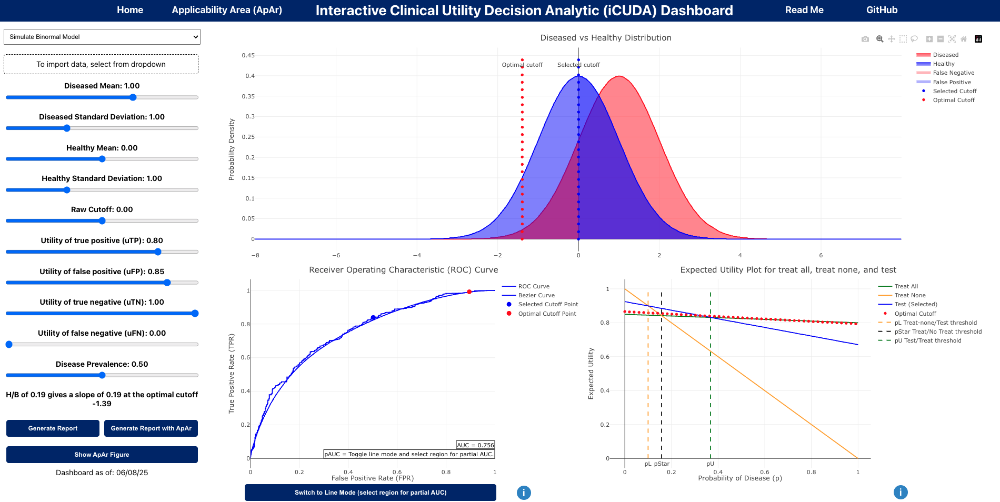

# iCUDA - Interactive Clinical Utility Decision Analytic Dashboard

## About This Dashboard  
[Temporary Link](https://icuda-cah8f2cfgzcba8fn.eastus2-01.azurewebsites.net/) — **currently undergoing optimization**

Driven by **decision analysis** and **utility theory**, this dashboard is designed to be intuitive and interactive, allowing users to visualize and analyze the utility of machine learning (ML) models in various contexts. It focuses on evaluating the **success and failure modes** of these models in the target context.

## Team

- **Star SD Liu, MS** - PhD Student
- **Harold P. Lehmann, MD, PhD** - Mentor

## Main Dashboard

The main dashboard provides a typical machine learning evaluation interface with a touch of decision analysis. It allows users to examine the utility of different operating points on the ROC curve, considering harms and benefits expressed on a utility scale from 0 to 1.

The default mode is designed for **educational demonstrations**, while the 'Imported Data' mode is suitable for **decision-analytic evaluations of real-world ML model performance** (currently limited to binary classification problems).

For a complete assessment of model performance and applicability, we recommend adding the ApAr figure (bottom left button 'Show ApAr Figure').

## Applicability Area (ApAr) Dashboard

The [Applicability Area (ApAr)](https://pubmed.ncbi.nlm.nih.gov/38222359/) figure/dashboard uses a decision-analytic and utility-based approach to evaluate clinical predictive models. It communicates the **range of prior probabilities** and **test cutoffs** where the model has **positive utility**, meaning it is useful.

## Info Buttons

Throughout the dashboard, you'll find info buttons that provide additional tips and resources. These are designed to offer helpful context and explanations for key parts of the dashboard.

---

## Getting Started Locally

To get the dashboard running on your local machine, follow these steps:

1. **Clone the Repository:**
  ```bash
  git clone <repository-url>
  ```
2. **Navigate to the Project Directory:**
  ```bash
  cd icuda-dashboard
  ```
3. **Install Dependencies:**
  ```bash
  npm install
  ```
4. **Install Dependencies:**
  ```bash
  npm start
  ```
5. **Access the Dashboard: Open your browser and navigate to http://localhost:3000**

## Technologies Used

- **React.js** - Frontend framework
- **Plotly.js** - Interactive visualizations
- **JavaScript/ES6** - Core programming language
- **CSS3** - Styling and layout


